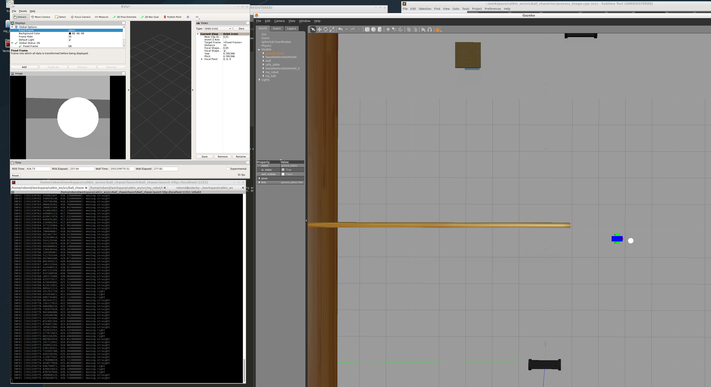

# GazeboWorld

[](https://www.udacity.com/robotics)

# RoboND-Go Chase It!
The **Go Chase It** project is to build a world then let a robot chase a ball within this world. In this project, two ROS packages are created `drive_bot` and `ball_chaser`. Here are the steps to design the robot, house it inside your world, and program it to chase white-colored balls.

### Directory Structure
```
    .Project2                          # Go Chase It Project
    ├── my_robot                       # my_robot package                   
    │   ├── launch                     # launch folder for launch files   
    │   │   ├── robot_description.launch
    │   │   ├── world.launch
    │   ├── meshes                     # meshes folder for sensors
    │   │   ├── hokuyo.dae
    │   ├── urdf                       # urdf folder for xarco files
    │   │   ├── my_robot.gazebo
    │   │   ├── my_robot.xacro
    │   ├── world                      # world folder for world files
    │   │   ├── gazeboworld.world
    │   ├── CMakeLists.txt             # compiler instructions
    │   ├── package.xml                # package info
    ├── ball_chaser                    # ball_chaser package                   
    │   ├── launch                     # launch folder for launch files   
    │   │   ├── ball_chaser.launch
    │   ├── src                        # source folder for C++ scripts
    │   │   ├── drive_bot.cpp
    │   │   ├── process_images.cpp
    │   ├── srv                        # service folder for ROS services
    │   │   ├── DriveToTarget.srv
    │   ├── CMakeLists.txt             # compiler instructions
    │   ├── package.xml                # package info                  
    └──                              
```

### Robot Design

#### Steps:
* Modify the xacro file of `my_robot` to include the body (chassis and wheels), camera and lidar.
* Adding some colors to Then adding the plugins for differential drive, camera and lidar.
* After creating these changes, launch the model along with the world previous created and adjust the initial robot pose to make sure the robot is at an empty space in the world.

### Gazebo World

#### Steps:
* Create a white ball model.
* Insert the ball model into the existed world and save it as a new world.
* Make sure the ball can be dragged inside the world.

### Ball Chasing

#### Steps:
* `drive_bot` creates `ball_chaser/command_robot` service that will publish velocity (linear and angular) to the robot.
* In `drive_bot`, the `ball_chaser/command_robot` service returns/responses a string that prints robot's linear_x velocity and angular_z velocity.
* `process_image` subscribes to the `/camera/rgb/image_raw` topic and determines/callbacks which zone the whiteball is in. Once determines which zone is in, it will call the `ball_chaser/command_robot` service to send the corresponding velocities to the robot.
* If no ball is in the view, the robot should stop.

A view of the robot chasing the ball can be viewed here:


### Future Steps

* Add in the lidar reading so that the robot can keep some distance to the ball. Right now the robot will run into ball.
* Add some exploration mode to the robot so it can autonomously look for ball.
* Add random motion to the ball so its movement does not need to be manually controlled.